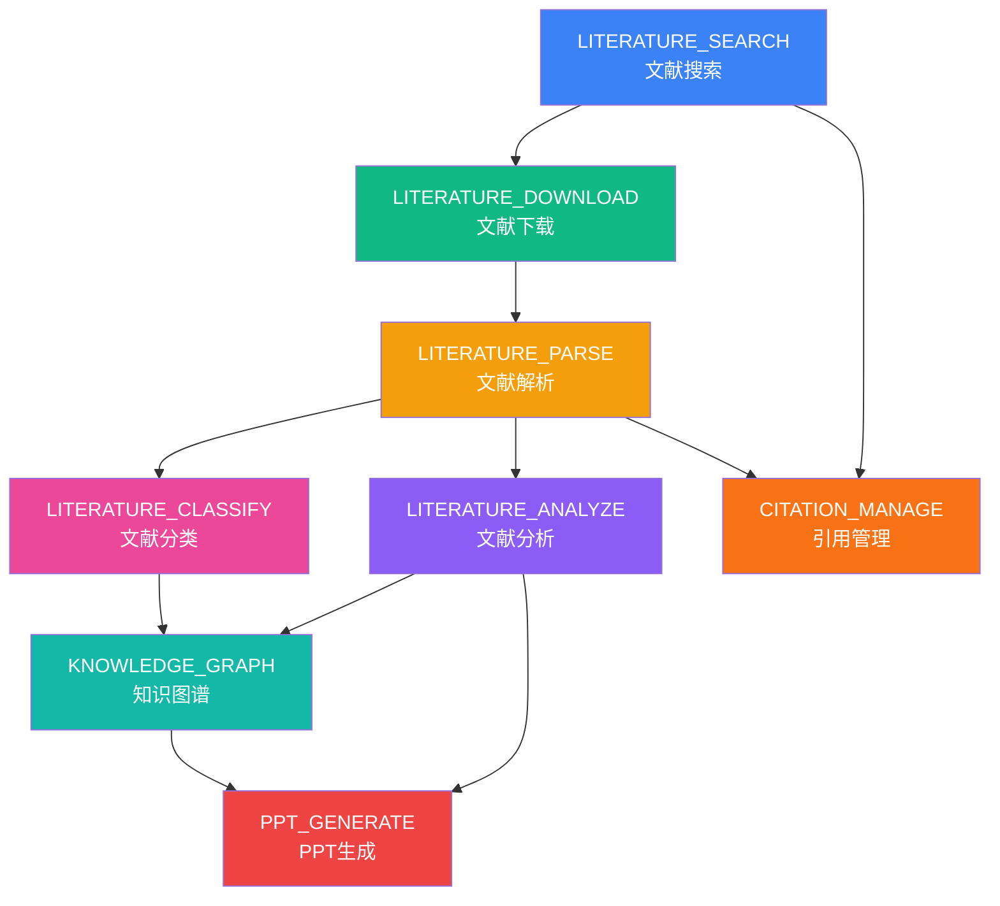

# CLAUDE.md

This file provides guidance to Claude Code (claude.ai/code) when working with code in this repository.

---

# LiteratureHub - 统一学术文献研究与汇报系统

基于 **Eigent Multi-Agent 架构** 设计的全流程文献管理与智能汇报系统。

**版本**: v1.0.0-alpha
**状态**: ✅ 核心功能已完成，可正常使用
**创建日期**: 2026-03-27
**最后更新**: 2026-03-29

---

## 快速开始

### 安装依赖

```bash
pip install -r requirements.txt
```

### 启动 GUI（推荐）

```bash
# 方式1：双击启动（Windows）
启动GUI.bat

# 方式2：命令行启动
python launch_gui.py
```

### 代码质量检查

```bash
# 格式化代码
black src/ scripts/

# 代码检查
flake8 src/ scripts/

# 类型检查
mypy src/
```

---

## 核心架构

### Multi-Agent 类型系统

LiteratureHub 基于 Eigent 架构实现了 **8 种专业化 Agent**，每种 Agent 都有明确的职责、能力和依赖关系。

#### Agent 类型定义

位置：`src/core/agents/types.py`

```python
class AgentType(str, Enum):
    LITERATURE_SEARCH = "literature_search_agent"      # 文献搜索
    LITERATURE_DOWNLOAD = "literature_download_agent"  # 文献下载
    LITERATURE_PARSE = "literature_parse_agent"        # 文献解析（PDF → Markdown）
    LITERATURE_ANALYZE = "literature_analyze_agent"    # 文献分析
    LITERATURE_CLASSIFY = "literature_classify_agent"  # 文献分类
    KNOWLEDGE_GRAPH = "knowledge_graph_agent"          # 知识图谱构建
    PPT_GENERATE = "ppt_generate_agent"                # PPT 内容生成
    CITATION_MANAGE = "citation_manage_agent"          # 引用管理
```

#### Agent 依赖关系

```
文献搜索 → 文献下载 → 文献解析
                         ↓
              ┌──────────┴──────────┐
              ↓                     ↓
         文献分析 ←→ 文献分类
              ↓             ↓
         知识图谱 ←─────────┘
              ↓
         PPT生成
              ↑
         引用管理
```

#### 使用示例

```python
from src.core.agents.types import AgentType, AGENT_REGISTRY, validate_agent_workflow

# 获取 Agent 信息
info = AGENT_REGISTRY[AgentType.LITERATURE_ANALYZE]
print(f"名称: {info.name_cn}")      # 输出: 文献分析代理
print(f"颜色: {info.color}")         # 输出: #8B5CF6
print(f"能力: {info.capabilities}")  # 输出: [...]

# 验证工作流
workflow = [
    AgentType.LITERATURE_SEARCH,
    AgentType.LITERATURE_DOWNLOAD,
    AgentType.LITERATURE_ANALYZE
]
is_valid = validate_agent_workflow(workflow)
print(f"工作流有效: {is_valid}")  # 输出: True
```

---

## 核心模块

### 1. 工作流引擎（`src/workflow/`）

提供完整的任务编排和状态管理功能：

| 组件 | 文件 | 状态 |
|------|------|------|
| 依赖管理器 | `dependency_manager.py` | ✅ 已实现 |
| 编排器 | `orchestrator.py` | ✅ 已实现 |
| 执行器 | `executor.py` | ✅ 已实现 |
| 状态追踪器 | `state_tracker.py` | ✅ 已实现 |
| 增量更新器 | `incremental_updater.py` | ✅ 已实现 |
| 页面工作流 | `page1_workflow.py` | ✅ 已实现 (1641行) |
| 批量分类器 | `batch_classify.py` | ✅ 已实现 |

### 2. 文献搜索（`src/search/`）

支持多个学术数据库：

| 搜索器 | 文件 | 状态 |
|--------|------|------|
| Elsevier 搜索器 | `elsevier_searcher.py` | ✅ 已实现 |
| arXiv 搜索器 | `arxiv_searcher.py` | ✅ 已实现 |
| IEEE 搜索器 | `ieee_searcher.py` | ✅ 已实现 |
| Springer 搜索器 | `springer_searcher.py` | ✅ 已实现 |
| 多源搜索器 | `multi_source_searcher.py` | ✅ 已实现 |
| 关键词翻译器 | `keyword_translator.py` | ✅ 已实现 (GLM API) |

### 3. 文献下载（`src/download/`）

多源下载策略：

| 下载器 | 文件 | 状态 |
|--------|------|------|
| Unpaywall 客户端 | `unpaywall_client.py` | ✅ 已实现 (合法优先) |
| SciHub 下载器 | `scihub_downloader.py` | ✅ 已实现 (支持2024+格式) |
| 多源下载器 | `multi_source_downloader.py` | ✅ 已实现 |
| 代理管理器 | `proxy_manager.py` | ✅ 已实现 |
| VPN 检测器 | `vpn_detector.py` | ✅ 已实现 (Mihomo) |

**下载策略**：
1. Unpaywall 优先（约 20-30% 成功率，合法）
2. SciHub 备用（需要 VPN，自动启动 Mihomo）
3. 智能代理切换（并发测试，选择最低延迟）

### 4. 文献分析（`src/analysis/`）

AI 深度分析：

| 分析器 | 文件 | 状态 |
|--------|------|------|
| AI 分析器 | `ai_analyzer.py` | ✅ 已实现 (6维度) |
| 分类器 | `classifier.py` | ✅ 已实现 (10大领域) |
| 评分器 | `scoring.py` | ✅ 已实现 |
| 管理器 | `manager.py` | ✅ 已实现 |

**分析维度**：
- 创新点三元组：前人工作, 本文创新, 创新意义
- 研究动机五问：研究问题, 研究空白, 研究假设, 预期贡献, 实际贡献
- 技术路线图：方法演进, 关键技术, 技术选型理由
- 机理解释：物理机制, 数学原理, 验证方法
- 影响评估：学术影响, 工程应用, 后续研究
- 历史脉络：起源发展, 关键节点, 未来趋势

### 5. GUI（`scripts/` + `src/gui/`）

Tkinter 图形界面：

| 组件 | 文件 | 状态 |
|------|------|------|
| 主窗口 | `main_window.py` | ✅ 已实现 |
| 文献列表面板 | `literature_list_panel.py` | ✅ 已实现 |
| 分析进度面板 | `analysis_progress_panel.py` | ✅ 已实现 |
| 搜索对话框 | `search_dialog.py` | ✅ 已实现 |
| Page 1 GUI | `scripts/page1_gui.py` | ✅ 已实现 (完整中文界面) |

---

## 关键配置文件

### API 密钥配置

位置：`config/api_keys.yaml`

```yaml
# GLM API（关键词翻译、AI 分析）
glm:
  api_keys:
    - "YOUR_GLM_API_KEY"
  base_url: "https://open.bigmodel.cn/api/paas/v4"
  model: "glm-4-plus"

# Elsevier API（文献搜索）
elsevier:
  api_key: "YOUR_ELSEVIER_API_KEY"
  inst_token: ""

# Unpaywall（开放获取文献下载）
unpaywall:
  email: "your-email@example.com"

# DeepSeek API（可选）
deepseek:
  api_key: "YOUR_DEEPSEEK_API_KEY"
  base_url: "https://api.deepseek.com"
```

### 工作流配置

位置：`config/workflow.yaml`

关键配置项：
- `search.max_results`: 每个数据库最大结果数（默认 100）
- `download.delay_range`: 下载延迟范围（避免被封）
- `analysis.batch.size`: 批处理大小（默认 10）
- `scoring.weights`: 评分权重（影响因子 70% + 时间权重 30%）

### 分析 Agent 配置

位置：`config/analysis_agents_config.yaml`

分析 Agent 的 Prompt 模板和参数配置。

### 分析关键词配置

位置：`config/analysis_keywords.yaml`

技术领域关键词和分类体系（10大技术领域）。

---

## 数据结构

### 项目数据目录

```
data/
├── projects/              # 项目数据
│   └── {project_name}/    # 项目名称
│       ├── pdfs/          # PDF 原文件
│       │   ├── all/       # 所有PDF
│       │   └── temp/      # 临时下载目录
│       └── markdown/      # Markdown 解析结果
│           └── all/       # 所有文献
│               └── {paper_id}/
│                   └── full.md
├── cache/                 # 缓存目录
├── backups/               # 数据库备份
└── literature_hub.db      # SQLite 数据库（计划中）
```

---

## API 客户端使用

### GLM API 客户端

位置：`src/api/glm_client.py`

```python
from src.api.glm_client import GLMAPIClient

client = GLMAPIClient(
    api_key="your_api_key",
    base_url="https://open.bigmodel.cn/api/paas/v4",
    model="glm-4-plus"
)

# 异步调用
response = await client.async_generate(
    prompt="分析这篇文献的创新点",
    temperature=0.7
)
```

### MinerU API 客户端

位置：`src/api/mineru_client.py`

```python
from src.api.mineru_client import MinerUClient, parse_pdf_file

client = MinerUClient()

# 解析单个PDF
result = await client.parse_pdf_async(
    pdf_path="path/to/paper.pdf",
    model_version="vlm"  # pipeline | vlm | MinerU-HTML
)

# 批量解析
results = await parse_pdf_files(
    pdf_paths=["paper1.pdf", "paper2.pdf"],
    progress_callback=lambda x: print(f"进度: {x}")
)
```

---

## PPT 辅助模块（总分总架构）

LiteratureHub 集成了基于"总分总"结构的 PPT 辅助模块，用于生成符合博士论文汇报标准的 PPT 内容。

### 模块位置

```
LiteratureHub/
├── src/ppt_helper/
│   ├── agents/              # AI Agents（GLM-5）
│   │   ├── base_agent.py           # Agent 基类
│   │   ├── overview_agent.py      # Phase 1: 概览分析
│   │   ├── domain_analyzer_agent.py # Phase 2: 领域深度分析
│   │   └── summary_agent.py        # Phase 3: 综合总结
│   ├── workers/             # Workers（元数据提取）
│   │   ├── content_extractor.py
│   │   ├── markdown_locator.py
│   │   └── data_copier.py
│   ├── readers/             # Markdown 读取器
│   │   └── full_md_reader.py
│   └── prompts/             # Prompt 模板
│       └── __init__.py
├── scripts/ppt_helper/      # 三阶段流程脚本
│   ├── 01_overview.py       # Phase 1
│   ├── 02_domain_analysis.py # Phase 2
│   ├── 03_summary.py        # Phase 3
│   ├── 04_generate_html.py  # HTML 生成
│   ├── master_pipeline.py   # 一键执行
│   └── view_results.py      # 结果查看
└── config/ppt_helper_config.yaml
```

### 总分总三阶段架构

```
Phase 1: 总（概览分析）
  输入：agent_results 汇总（JSON 格式）
  任务：AI 推断领域分类、识别研究热点、分析时间趋势
  输出：phase1_overview.json
      ↓
Phase 2: 分（领域深度分析）
  输入：原始 full.md 文件 + agent_results
  任务：按领域深度分析，必须引用原文支持结论
  输出：by_domain/{domain_name}/domain_analysis.json
      ↓
Phase 3: 总（综合总结）
  输入：Phase 1 概览 + Phase 2 领域分析 + 重点论文 agent_results
  任务：生成 4 部分 PPT 内容（博士论文汇报框架）
  输出：final_ppt_content.json + HTML 文件
```

### 博士论文汇报框架（Phase 3 输出）

⚠️ **这是标准的博士论文科研进展汇报框架，必须严格遵守！**

1. **01 课题研究综述**（包含国内外研究现状）
   - 研究背景及意义
   - 国内外研究现状（2018-2026 时间脉络）

2. **02 课题创新性**
   - 新现象、新方法、新对象
   - 明确是否有创新性（从没有做过或延续前人未做完）

3. **03 思路及方法**
   - 根据课题创新性衍生
   - 技术路线对比
   - 工具和算法选择

4. **04 后续工作完成**
   - 推进计划（短期/中期/长期）
   - 未完成工作情况
   - 完成节点

### PPT 辅助模块使用方法

```bash
cd LiteratureHub

# 方式一：分步执行（推荐）

# Phase 1: 概览分析
python scripts/ppt_helper/01_overview.py

# Phase 2: 领域深度分析
python scripts/ppt_helper/02_domain_analysis.py

# Phase 3: 综合总结（生成 JSON）
python scripts/ppt_helper/03_summary.py

# 生成 HTML 文件
python scripts/ppt_helper/04_generate_html.py

# 方式二：一键执行 Phase 1 + Phase 2
python scripts/ppt_helper/master_pipeline.py

# 查看结果
python scripts/ppt_helper/view_results.py --all
```

### 数据路径配置

位置：`config/ppt_helper_config.yaml`

```yaml
data_paths:
  # 输入数据（直接使用 LiteratureHub 现有数据）
  source_agent_results: "data/agent_results"
  source_markdowns: "data/projects/wind_aero/markdown"

  # 输出数据
  processed_data: "data/ppt_helper/processed"
  domain_results: "data/ppt_helper/processed/by_domain"
  final_output: "data/ppt_helper/processed/final_ppt_content.json"
```

### Worker-Agent 分离原则

**核心设计理念**：
- **Workers（工人活）**：只做元数据提取、文件操作
- **AI Agents（大脑活）**：所有理解、分析、推理任务

**好处**：
- 职责清晰，易于维护
- AI 专注于理解，Python 专注于数据搬运
- 便于测试和调试

### 关键提示词位置

所有提示词在 `src/ppt_helper/prompts/__init__.py` 中定义：

| 提示词 | 行号 | 对应阶段 |
|--------|------|---------|
| `OVERVIEW_PROMPT` | 11-151 | Phase 1 |
| `DOMAIN_ANALYZER_PROMPT` | 212-425 | Phase 2 |
| `SUMMARY_PROMPT` | 432-620 | Phase 3 |

---

## 常见任务

### 任务 1: 使用 GUI 进行文献管理

```bash
# 启动 GUI
python launch_gui.py

# GUI 功能流程：
# 1. Elsevier 搜索 → 搜索学术文献（支持中文关键词）
# 2. SciHub 下载 → 自动下载 PDF（Unpaywall 优先，SciHub 备用）
# 3. 处理临时文件 → 处理手动下载的 PDF
# 4. 文献分类 → AI 智能分类（10大技术领域）
# 5. MinerU 转换 → PDF 转 Markdown（需要 MinerU API）
```

### 任务 2: 验证工作流有效性

```python
from src.core.agents.types import AgentType, validate_agent_workflow

workflow = [
    AgentType.LITERATURE_SEARCH,
    AgentType.LITERATURE_DOWNLOAD,
    AgentType.LITERATURE_ANALYZE,
    AgentType.PPT_GENERATE
]

is_valid = validate_agent_workflow(workflow)
print(f"工作流有效: {is_valid}")
```

### 任务 3: 批量分类文献

```python
from src.workflow.batch_classify import BatchPaperClassifier

classifier = BatchPaperClassifier(
    api_key="your_glm_api_key",
    model="glm-4.7"
)

result = classifier.classify_papers_batch(
    papers=papers,
    domains=["Aerodynamic Optimization", "Wind Turbine Control"],
    categories_dir=Path("data/projects/wind_aero/categories"),
    metadata_file=Path("data/projects/wind_aero/pdfs/all/metadata.json")
)
```

---

## 系统架构图



---

## 开发指南

### 添加新的 Agent

1. 在 `src/core/agents/types.py` 中添加新的 `AgentType`
2. 在 `AGENT_REGISTRY` 中配置显示信息
3. 在 `src/core/factory/` 中创建对应的工厂类
4. 在 `src/prompts/agent_prompts.py` 中添加 System Prompt

### 代码风格

- **格式化**: Black
- **代码检查**: Flake8
- **类型提示**: Python 3.10+ 类型提示
- **文档字符串**: Google Style Docstrings

---

## 技术栈

- **语言**: Python 3.10+
- **AI 模型**: GLM-4 Plus（智谱 AI）、DeepSeek
- **文献搜索**: pybliometrics (Elsevier Scopus API)
- **文献下载**: Unpaywall（开放获取）、SciHub（备用）
- **浏览器自动化**: Selenium + Chrome DevTools Protocol
- **PDF 解析**: MinerU API（在线服务）
- **数据库**: SQLite 3（计划中）
- **配置管理**: PyYAML
- **GUI**: Tkinter
- **开发工具**: black, flake8, mypy

---

## 已知限制

1. **SciHub 依赖**：需要 VPN，系统自动启动 Mihomo
2. **MinerU API**：需要网络连接，可能不稳定
3. **GLM API 配额**：需要配置有效的 API 密钥
4. **数据库**：尚未实现，目前使用 JSON 文件存储

---

## 故障排除

### 常见问题

1. **GUI 无法启动**
   - 解决：确保安装了 Python Tcl/Tk 支持

2. **SciHub 下载失败**
   - 解决：检查 Mihomo 代理是否正常运行

3. **MinerU 解析失败**
   - 解决：检查网络连接和 API 密钥

4. **GLM API 调用失败**
   - 解决：检查 API 密钥是否有效

---

## 相关资源

- **Eigent**: https://github.com/eigent-ai/eigent - Multi-Agent 架构参考
- **MinerU**: https://opendatalab.github.io/MinerU/ - PDF 文档解析工具
- **Elsevier API**: https://dev.elsevier.com/ - 学术文献搜索
- **Selenium**: https://www.selenium.dev/ - 浏览器自动化

---

*最后更新: 2026-03-29*
*当前状态: ✅ 核心功能已完成，可正常使用*
